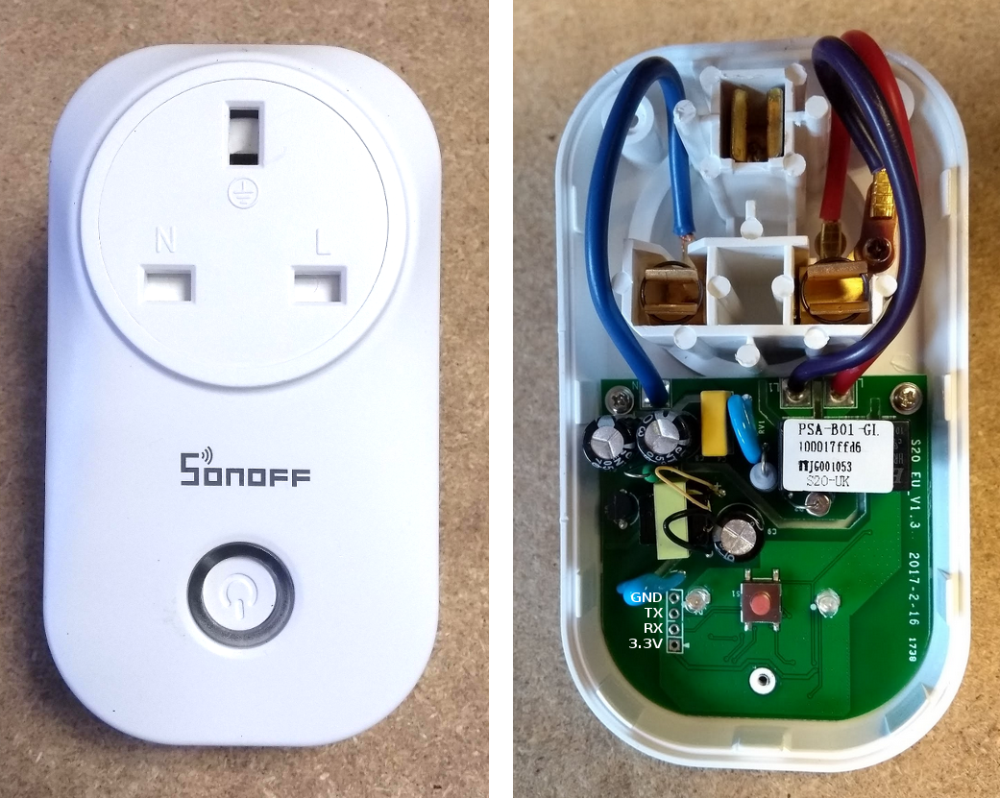

# Using EmonESP on the Sonoff S20 smart plug

This guide details how to use EmonESP on the Sonoff S20 smart plug. The SonOff can then be turned on and off via MQTT or/and used in conjunction with the emoncms demandshaper module for appliance scheduling based on the best time to use from a grid or/and carbon perspective. See:

[https://github.com/emoncms/demandshaper](https://github.com/emoncms/demandshaper)

**Sonoff S20 programmer:**

A standard USB to UART programing cable can be used to upload firmware to the SonOffS20 smart plug. Connect up power and RX/TX lines to the 4 pin programming connector on the plug:

To upload firmware, hold down the push button, reset the power to the plug (unplug and plug the programmer back in) and then keep holding down the push button until the firmware upload progress starts. 

**Safety: Disconnect the plug from the mains when programming**
It's advised not to connect to the mains when the case is open from a safety perspective for obvious reasons.

**Firmware modifications:**

Download EmonESP and switch to control_merge branch:

    git clone https://github.com/openenergymonitor/EmonESP.git
    git checkout control_merge

**Compilation:**

Sonoff S20 smart plugs can have either the ESP8266 or **ESP8285** core.

Select in Arduino > Tools:

- Generic ESP8285 Module
- Flash Size "1M (512K SPIFFS)"

Compile and upload both the firmware and the sketch data.

### Setup

1. SmartPlug creates a WIFI access point, connect to access point, enter home WIFI network.

2. To use the plug with the emoncms demand shaper module see the user guide at the bottom of the readme here: [https://github.com/emoncms/demandshaper](https://github.com/emoncms/demandshaper).

3. Alternatively to control the Sonoff S20 directly via MQTT. Enter the MQTT server details on the EmonESP configuration page.

To turn the plug on, publish a topic:message of the following format:

    topic                     message
    emon/smartplug1/status    1
    
To turn the plug off, publish a topic:message of the following format:

    topic                     message
    emon/smartplug1/status    0
